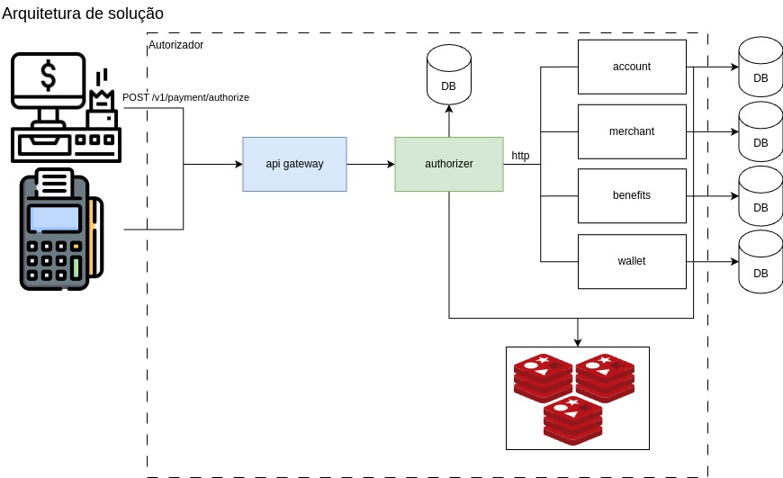

# Desafio Caju

Este projeto foi criado para cumprir o desafio proposto pela Caju. [Siga o link](https://caju.notion.site/Desafio-T-cnico-para-fazer-em-casa-218d49808fe14a4189c3ca664857de72)

## Arquitetura alvo



A proposta dessa arquitetura é garantir alta performance e escalabilidade, com componentes bem definidos e distribuídos para suportar grandes volumes de requisições. O API Gateway desempenha um papel fundamental, distribuindo a carga entre os serviços de forma balanceada, o que permite uma resposta mais rápida e eficiente aos clientes, além de facilitar o controle centralizado de autenticação e autorização.

O serviço de autorização foi desenvolvido seguindo o padrão SAGA, permitindo a gestão de transações distribuídas de forma confiável. Esse padrão é ideal para garantir a consistência de dados em operações complexas, onde várias etapas e serviços precisam ser coordenados. Com o SAGA, em caso de falhas, é possível realizar rollbacks apropriados, garantindo a integridade dos dados sem comprometer a experiência do usuário.

Além disso, o serviço de autorização se comunica com APIs externas para obter informações essenciais ao processo de autorização, como dados de contas, benefícios e saldo de carteiras. Essa integração permite que o sistema consulte e valide, em tempo real, as informações necessárias para uma autorização precisa e segura.

## Design de código

Para o desenvolvimento deste serviço, optou-se pelo uso de Clean Architecture para garantir uma estrutura modular, de fácil manutenção e com independência de tecnologias externas. A separação clara entre camadas permite uma maior flexibilidade, facilitando a substituição de componentes e promovendo boas práticas de design de software.

### Estrutura dos Pacotes

- **Domain**: Contém o coração do sistema, com as entidades e regras de negócio fundamentais. Nesta camada, são definidos os conceitos principais do domínio do serviço de autorização, como classes e interfaces que representam o comportamento esperado dos objetos do sistema. Essa camada é isolada de qualquer dependência de framework, garantindo sua independência.

- **Application**: Nesta camada estão os casos de uso, responsáveis pela orquestração das regras de negócio e por realizar o fluxo específico das operações do serviço. Os casos de uso recebem as requisições da camada de interface e delegam o trabalho ao domínio, assegurando que as regras de negócio sejam corretamente aplicadas.

- **Infrastructure**: Esta camada contém implementações que interagem com sistemas externos, como configurações de banco de dados, APIs externas, e adaptadores de persistência. Aqui, também ficam os componentes de comunicação, como as configurações de API Client, incluindo o uso do OpenFeign para integração com outros serviços.

## Ferramentas utilizadas

- Kotlin
- Spring Boot
- Spring Cloud OpenFeign
- Mysql
- JUnit 5
- Mockk

## Instação do projeto e utilização

- Construir e subir os Contêineres

```bash
cd docker && docker-compose up -d --build
```

- Verificar se os contêineres estão rodando
```bash
docker compose ps
```

- Enviar requisição para o autorizador
```bash
curl --request POST \
  --url http://localhost:8080/v1/payment \
  --header 'Content-Type: application/json' \
  --data '{
	"account": "075aab28-2265-420f-aa5e-253195617e9f",
	"totalAmount": 300.01,
	"mcc": "5811",
	"merchant": "PADARIA DO ZE               SAO PAULO BR"
}'
```

- Parar os contêineres
```bash
docker compose down
```